# AI Knowledge Graph Structure Visualization

This document provides a visual representation of the AI_KNOWLEDGE_GRAPH.yaml structure for both human understanding and AI agent navigation.

## Knowledge Graph Organization Chart

```mermaid
graph TD
    A[AI_KNOWLEDGE_GRAPH.yaml] --> B[project]
    A --> C[environment]
    A --> D[workflows]
    A --> E[critical_files]
    A --> F[security_critical_patterns]
    A --> G[known_issues]
    A --> H[error_handling]
    A --> I[tool_usage_matrix]
    A --> J[automation_opportunities]
    A --> K[context_requirements]
    A --> L[knowledge_graph_tags]

    B --> B1[name: NEaR]
    B --> B2[type: LLM platform]
    B --> B3[tech_stack]
    B --> B4[deployment: Vercel]

    C --> C1[project_id]
    C --> C2[supabase_url]
    C --> C3[dashboard_url]
    C --> C4[critical_env_vars]
    
    C4 --> C4a[NEXT_PUBLIC_SUPABASE_URL]
    C4 --> C4b[NEXT_PUBLIC_SUPABASE_ANON_KEY]
    C4 --> C4c[SUPABASE_SERVICE_ROLE_KEY]
    C4 --> C4d[USER_API_KEY_ENCRYPTION_SECRET]

    D --> D1[development]
    D --> D2[database_administration]
    
    D1 --> D1a[setup]
    D1 --> D1b[daily_workflow]
    D1 --> D1c[deployment_process]
    
    D2 --> D2a[setup]
    D2 --> D2b[health_checks]
    D2 --> D2c[performance_optimization]

    E --> E1[authentication]
    E --> E2[documentation]
    
    E1 --> E1a[lib/supabase/server.ts]
    E1 --> E1b[lib/supabase/client.ts]
    
    E2 --> E2a[CLAUDE_WAKEUP.md]
    E2 --> E2b[docs/TROUBLESHOOTING.md]
    E2 --> E2c[rls_performance_analysis.md]

    F --> F1[never_do]
    F --> F2[always_do]
    
    F1 --> F1a[Using anon key in server]
    F1 --> F1b[RLS changes to production]
    F1 --> F1c[Deploy without type-check]
    
    F2 --> F2a[Use service role key]
    F2 --> F2b[Add explicit TypeScript types]

    G --> G1[resolved]
    G --> G2[ongoing]
    
    G1 --> G1a[Production auth failures]
    G1 --> G1b[Analysis dropdown clearing]
    
    G2 --> G2a[RLS performance warnings]
    G2 --> G2b[Multiple permissive policies]

    H --> H1[authentication_failures]
    H --> H2[build_failures]
    H --> H3[api_key_management_hanging]

    I --> I1[mcp_supabase_tools]
    I --> I2[supabase_cli]
    I --> I3[standard_dev_tools]

    J --> J1[health_monitoring]
    J --> J2[performance_analysis]

    K --> K1[before_database_changes]
    K --> K2[before_authentication_fixes]
    K --> K3[before_performance_optimizations]

    L --> L1[nextjs-15]
    L --> L2[supabase-authentication]
    L --> L3[database-performance]
    L --> L4[ai-agent-workflows]

    style A fill:#e1f5fe
    style F fill:#ffebee
    style G fill:#fff3e0
    style I fill:#e8f5e8
    style J fill:#f3e5f5
```

## Section Navigation Guide

### For AI Agents

**Quick Access Patterns:**
- **Emergency/Critical Issues** → `security_critical_patterns.never_do`
- **Environment Setup** → `environment.critical_env_vars`
- **Tool Selection** → `tool_usage_matrix`
- **Error Resolution** → `error_handling`
- **Performance Tasks** → `workflows.database_administration.performance_optimization`

**Workflow Entry Points:**
- **New Project Setup** → `workflows.development.setup`
- **Daily Development** → `workflows.development.daily_workflow`
- **Database Admin** → `workflows.database_administration`
- **Health Monitoring** → `automation_opportunities.health_monitoring`

### For Human Developers

**Understanding the Structure:**
- **Project Context** → `project` section provides high-level overview
- **Security Concerns** → `security_critical_patterns` shows critical do's and don'ts
- **Issue History** → `known_issues` contains lessons learned from production problems
- **Tool Guidelines** → `tool_usage_matrix` explains when to use which technology

**Cross-Reference Points:**
- Each section links to relevant human documentation files
- `critical_files` section maps to actual codebase locations
- `context_requirements` explain prerequisites for safe operations

## Color Coding Legend

- 🔵 **Blue (Primary)** - Core structural elements and main categories
- 🔴 **Red (Critical)** - Security patterns and critical warnings  
- 🟠 **Orange (Issues)** - Known problems and their resolution status
- 🟢 **Green (Tools)** - Tool selection and usage guidelines
- 🟣 **Purple (Automation)** - Opportunities for automated monitoring and tasks

## Usage in Knowledge Graphs

This structure enables:
- **Semantic Search** - Tags allow relationship-based queries
- **Agent Coordination** - Clear tool boundaries prevent conflicts
- **Context Awareness** - Prerequisites ensure safe operation sequences
- **Error Recovery** - Structured error handling with specific remediation steps

## Maintenance Notes

When updating the YAML structure:
1. **Preserve hierarchy** - Maintain the tree structure for consistent navigation
2. **Update this chart** - Keep visual representation current with YAML changes
3. **Cross-reference docs** - Ensure links to human documentation remain valid
4. **Test agent workflows** - Verify AI agents can still navigate effectively

---

**Related Files:**
- [AI_KNOWLEDGE_GRAPH.yaml](AI_KNOWLEDGE_GRAPH.yaml) - The actual structured data
- [DOCUMENTATION_STRATEGY.md](DOCUMENTATION_STRATEGY.md) - Human vs AI documentation guidelines
- [CLAUDE_WAKEUP.md](CLAUDE_WAKEUP.md) - AI agent session context and memory