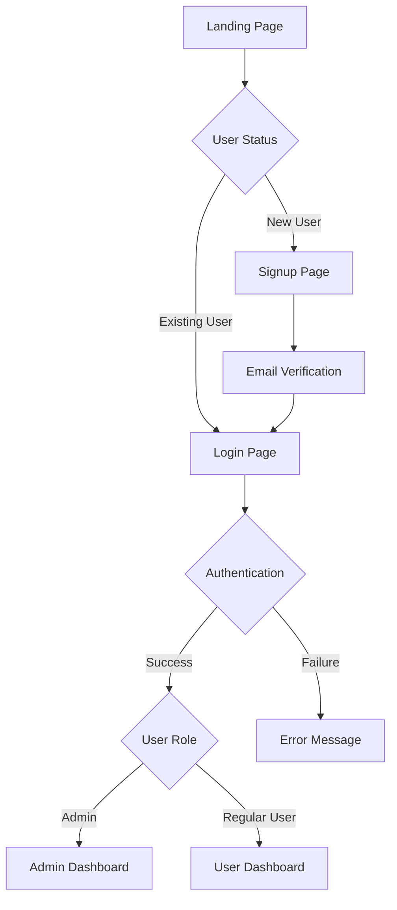
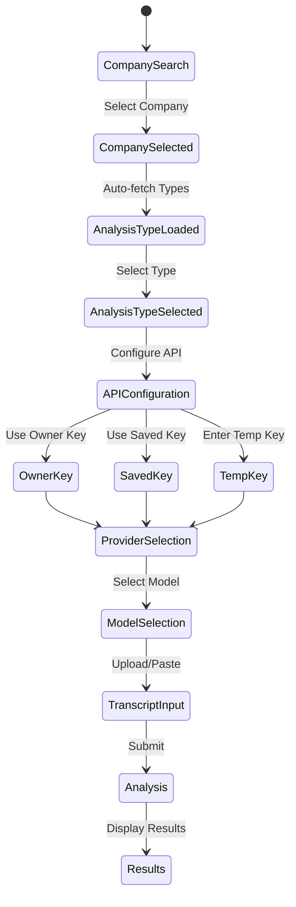

# NextER Complete Documentation

This document consolidates the technical architecture, user journey, and development guidelines for the NextER (Next Earnings Release) application.

---

## Table of Contents

1. [System Architecture](#system-architecture)
2. [Database Schema](#database-schema)
3. [User Journey & Workflows](#user-journey--workflows)
4. [UI/UX Design System](#uiux-design-system)
5. [Development Standards](#development-standards)
6. [Security Considerations](#security-considerations)
7. [Performance Optimization](#performance-optimization)
8. [API Reference](#api-reference)

---

## System Architecture

### Frontend
- **Framework**: Next.js 15.4.1 with App Router
- **State Management**: React useState hooks and useReducer for complex state
- **Styling**: Tailwind CSS with retro CRT color scheme
- **TypeScript**: Strict mode enabled
- **Authentication**: Supabase Auth with JWT

### Backend
- **Database**: Supabase PostgreSQL with Row Level Security (RLS)
- **API Routes**: Next.js API routes for all backend operations
- **Deployment**: Vercel with auto-deploy from git main branch
- **Production**: ✅ LIVE at https://lanoitcif.com

### LLM Integration
- **Providers**: OpenAI, Anthropic, Google, Cohere
- **Models**: Latest 2025 models (GPT-4.1, Claude 4, Gemini 2.5, Command-A-03)
- **Token Limits**: Increased to 16K for long transcripts
- **Cost Tracking**: Full usage logging and estimation

---

## Database Schema

### Core Tables

#### user_profiles
```sql
CREATE TABLE public.user_profiles (
  id UUID REFERENCES auth.users(id) ON DELETE CASCADE PRIMARY KEY,
  email TEXT NOT NULL,
  full_name TEXT,
  can_use_owner_key BOOLEAN DEFAULT FALSE,
  is_admin BOOLEAN DEFAULT FALSE,
  access_level TEXT NOT NULL DEFAULT 'basic' CHECK (access_level IN ('basic', 'advanced', 'admin')),
  created_at TIMESTAMP WITH TIME ZONE DEFAULT NOW(),
  updated_at TIMESTAMP WITH TIME ZONE DEFAULT NOW()
);
```

#### user_api_keys
```sql
CREATE TABLE public.user_api_keys (
  id UUID DEFAULT uuid_generate_v4() PRIMARY KEY,
  user_id UUID REFERENCES public.user_profiles(id) ON DELETE CASCADE NOT NULL,
  provider TEXT NOT NULL CHECK (provider IN ('openai', 'anthropic', 'google', 'cohere')),
  encrypted_api_key TEXT NOT NULL,
  encryption_iv TEXT NOT NULL,
  nickname TEXT,
  created_at TIMESTAMP WITH TIME ZONE DEFAULT NOW(),
  updated_at TIMESTAMP WITH TIME ZONE DEFAULT NOW(),
  assigned_by_admin BOOLEAN DEFAULT FALSE,
  admin_assigned_at TIMESTAMP WITH TIME ZONE,
  admin_assigned_by UUID REFERENCES public.user_profiles(id),
  default_model TEXT,
  UNIQUE(user_id, provider, nickname)
);
```

#### prompts
```sql
CREATE TABLE public.prompts (
  id UUID DEFAULT uuid_generate_v4() PRIMARY KEY,
  name TEXT NOT NULL UNIQUE,
  display_name TEXT NOT NULL,
  description TEXT,
  system_prompt TEXT NOT NULL,
  category TEXT DEFAULT 'general',
  is_active BOOLEAN DEFAULT TRUE,
  created_at TIMESTAMP WITH TIME ZONE DEFAULT NOW(),
  updated_at TIMESTAMP WITH TIME ZONE DEFAULT NOW()
);
```

#### usage_logs
```sql
CREATE TABLE public.usage_logs (
  id UUID DEFAULT uuid_generate_v4() PRIMARY KEY,
  user_id UUID REFERENCES public.user_profiles(id) ON DELETE CASCADE NOT NULL,
  provider TEXT NOT NULL,
  model TEXT,
  prompt_id UUID REFERENCES public.prompts(id),
  token_count INTEGER,
  cost_estimate DECIMAL(10,6),
  used_owner_key BOOLEAN DEFAULT FALSE,
  created_at TIMESTAMP WITH TIME ZONE DEFAULT NOW()
);
```

### Industry-Specific Tables

- **company_types**: Industry analysis templates with structured metadata
- **companies**: Company ticker symbol to analysis type mappings
- **company_prompt_assignments**: Links companies to their analysis types

---

## User Journey & Workflows

### Authentication Flow



### Analysis Workflow



### Authorization Patterns

#### Client-Side Protection
```typescript
const { user, loading } = useAuth()
const router = useRouter()

useEffect(() => {
  if (!loading && !user) {
    router.push('/auth/login')
  }
}, [user, loading, router])
```

#### Server-Side Protection
```typescript
const authHeader = request.headers.get('authorization')
if (!authHeader?.startsWith('Bearer ')) {
  return NextResponse.json({ error: 'Unauthorized' }, { status: 401 })
}
```

---

## UI/UX Design System

### Color Palette
- **Cream Pixel Glow**: `#FAF3E3` / `cream-glow`
- **Sunbleached Coral**: `#F7797D` / `coral`
- **Retro Sunset Gold**: `#F4B860` / `sunset-gold`
- **Pacific Teal Mist**: `#59C9A5` / `teal-mist`
- **Pastel Fuchsia Buzz**: `#D881D4` / `fuchsia-buzz`
- **Cool Grape Static**: `#8D8BE0` / `grape-static`
- **Shadow Grid Charcoal**: `#2C2C32` / `charcoal`

### Component Patterns
- Card-based layouts with retro styling
- Loading skeletons for async operations
- Responsive design with mobile-first approach
- Consistent spacing and typography

---

## Development Standards

### Code Quality
- **TypeScript**: Strict mode required
- **Testing**: >80% coverage mandate
- **Linting**: ESLint with custom rules
- **Formatting**: Prettier configuration

### Git Workflow
- **Main Branch**: Direct commits for production
- **Auto-Deploy**: Vercel deploys on push
- **Commit Format**: Conventional commits

### Testing Commands
```bash
npm test         # Run test suite
npm run type-check  # TypeScript validation
npm run lint     # Code linting
npm run build    # Production build
```

---

## Security Considerations

### API Key Management
- **Encryption**: AES-256-GCM for stored keys
- **Access Control**: Permission-based key usage
- **No Client Exposure**: Keys never sent to frontend
- **Audit Trail**: Complete usage logging

### Authentication Security
- **JWT Tokens**: Secure session management with Supabase auth
- **Email Verification**: Required for new accounts
- **Role Validation**: Server-side permission checks
- **HTTPS**: Enforced in production

### **🚨 Critical Security Vulnerability (Identified July 26, 2025)**
**Location:** `/app/api/extract-pdf/route.ts`
**Issue:** Manual JWT decoding without signature verification
**Risk:** Token forgery and authentication bypass possible
**Status:** Pending immediate fix

**Current Vulnerable Pattern:**
```typescript
// DANGEROUS - No signature verification
const decoded = jwt.decode(token) as any
userId = decoded.sub
```

**Secure Pattern (Required):**
```typescript
// SECURE - Supabase validates signature
const { data: { user }, error } = await supabase.auth.getUser(token)
if (error || !user) return NextResponse.json({ error: 'Unauthorized' }, { status: 401 })
userId = user.id
```

### **Supabase 2025 Compliance Status**
- ✅ Using modern `@supabase/ssr` package (v0.5.1)
- ✅ No deprecated `@supabase/auth-helpers` dependencies  
- ⚠️ Manual JWT handling requires immediate removal
- ⚠️ Upgrade to `@supabase/ssr` v0.6.1 recommended
- 📅 Migration deadlines: Oct 2025 (new projects), Nov 2025 (existing projects)

### Row Level Security (RLS)
```sql
-- Users can view their own profile
CREATE POLICY "Users can view their own profile" ON public.user_profiles
  FOR SELECT USING (auth.uid() = id);

-- Admins can view all profiles
CREATE POLICY "Admins can view all profiles" ON public.user_profiles
  FOR SELECT TO authenticated
  USING (
    EXISTS (
      SELECT 1 FROM public.user_profiles
      WHERE id = auth.uid() 
      AND (access_level = 'admin' OR is_admin = true)
    )
  );
```

---

## Performance Optimization

### Current Metrics
- **Page Load**: Fast (Next.js SSR + Vercel CDN)
- **API Response**: Sub-second for most operations
- **LLM Analysis**: 2-15 seconds depending on provider/model
- **Database Queries**: Optimized with proper indexing

### Optimization Strategies
- Efficient database indexes on foreign keys
- Client-side caching with localStorage
- Lazy loading for heavy components
- Image optimization with Next.js Image

### Future Enhancements
- Redis Cache implementation
- CDN Integration for static assets
- Load Balancing for API routes
- Background Jobs for long operations

---

## API Reference

### Core Endpoints

#### POST /api/analyze
Main transcript analysis endpoint
- **Auth**: Bearer token required
- **Body**: `{ transcript, promptId, provider, model, apiKeyId }`
- **Returns**: Analysis results with usage stats

#### GET /api/user-api-keys
Retrieve user's saved API keys
- **Auth**: Bearer token required
- **Returns**: Array of key metadata (no actual keys)

#### POST /api/user-api-keys
Add new encrypted API key
- **Auth**: Bearer token required
- **Body**: `{ provider, apiKey, nickname }`
- **Returns**: Created key metadata

#### DELETE /api/user-api-keys/[id]
Remove API key
- **Auth**: Bearer token required
- **Params**: `id` - Key UUID
- **Returns**: Success confirmation

### Admin Endpoints

#### GET /api/admin/users
List all users (admin only)
- **Auth**: Admin bearer token required
- **Returns**: User profiles array

#### POST /api/admin/assign-api-key
Assign API key to user
- **Auth**: Admin bearer token required
- **Body**: `{ userId, provider, apiKey, defaultModel }`
- **Returns**: Assignment confirmation

#### GET /api/admin/stats
System statistics
- **Auth**: Admin bearer token required
- **Returns**: Usage metrics and counts

---

## Essential Tools Reference

### Vercel CLI
```bash
vercel login         # Authenticate
vercel ls           # List deployments
vercel --prod       # Deploy to production
vercel logs <url>   # View runtime logs
vercel env pull     # Pull environment variables
```

### Supabase MCP
```python
# Execute SQL
mcp__supabase__execute_sql(query="SELECT * FROM user_profiles")

# Apply migrations
mcp__supabase__apply_migration(name="fix_rls", query="...")

# Get logs
mcp__supabase__get_logs(service="auth")
```

### Local Development
```bash
npm run dev         # Start development server
npm run build       # Build for production
npm run type-check  # Check TypeScript types
npm run lint        # Run linter
```

---

## Contact & Resources

- **Production**: https://lanoitcif.com
- **GitHub**: https://github.com/lanoitcif/nextER
- **Vercel**: john@151westmain.com
- **Supabase**: john@151westmain.com

Last Updated: 2025-07-26