# Technical Guide

## 1. System Architecture and Design Patterns

### Frontend
- **Framework**: Next.js 15.0.3 with App Router
- **State**: React useState hooks
- **Styling**: Tailwind CSS with retro CRT color scheme
- **TypeScript**: Strict mode enabled

### Backend
- **Database**: Supabase PostgreSQL with RLS
- **Authentication**: Supabase Auth with JWT for all protected routes
- **API Routes**: Next.js API routes for analysis and management
- **Deployment**: Vercel with auto-deploy from git main branch

### LLM Integration
- **Providers**: OpenAI, Anthropic, Google, Cohere
- **Models**: Latest 2025 models (GPT-4.1, Claude 4, Gemini 2.5, Command-A-03)
- **Token Limits**: Increased to 16K for long transcripts
- **Cost Tracking**: Full usage logging and estimation

## 2. Database Schema and Management

### Core Tables

- **`user_profiles`**: User accounts and permissions, including roles.
- **`user_api_keys`**: Encrypted API key storage with metadata.
- **`prompts`**: Pre-built analysis templates
- **`usage_logs`**: API usage tracking and cost analytics
- **`system_settings`**: Admin-configurable system-wide settings.

### Industry-Specific Tables (New)

- **`company_types`**: Industry analysis templates with structured metadata (hospitality REIT, airline, credit card, etc.)
- **`companies`**: Company ticker symbol to analysis type mappings
- **`company_prompt_assignments`**: Links companies to their primary and additional analysis types

### Database Consistency Review - July 17, 2025

- **`company_types`**: Fixed `general_analysis` type having NULL values for JSON fields.
- **`prompts`**: Fixed all prompts having NULL `template_variables` field.
- **`company_prompt_assignments`**: Fixed some companies missing "earnings_analyst" assignments.

## 3. UI/UX Design System and Components

This document provides a comprehensive inventory of all UI elements by location throughout the NEaR application to ensure consistency when making aesthetic changes.

### Color Palette Reference
- **Cream Pixel Glow**: `#FAF3E3` / `cream-glow`
- **Sunbleached Coral**: `#F7797D` / `coral`
- **Retro Sunset Gold**: `#F4B860` / `sunset-gold`
- **Pacific Teal Mist**: `#59C9A5` / `teal-mist`
- **Pastel Fuchsia Buzz**: `#D881D4` / `fuchsia-buzz`
- **Cool Grape Static**: `#8D8BE0` / `grape-static`
- **Shadow Grid Charcoal**: `#2C2C32` / `charcoal`

For a full breakdown of all components and their styles, see the `DESIGN_SYSTEM.md` file.

## 4. Development Workflow and Standards

- **Production-Only Development Workflow**: All testing is done on Vercel Production.
- **Git Workflow**: All changes must be committed and pushed to git for testing.
- **Vercel Auto-Deploy**: Provides fast feedback (~30 seconds).
- **Systematic Debugging**: A methodical approach is used to prevent wasted effort on symptoms vs. root cause.

## 5. Testing and Deployment Procedures

- **Testing**: Jest, React Testing Library
- **Deployment**: Vercel/Netlify ready
- **Type checking**: `npm run type-check`
- **Linting**: `npm run lint`
- **Build**: `npm run build`
- **Testing**: `npm test`

## 6. Security Considerations

- **API Key Encryption**: AES-256-GCM for user keys
- **Row Level Security**: Database policies active
- **Authentication**: JWT validation on all protected routes
- **Input Validation**: Zod schemas on API endpoints

### API Key Storage Workflow

```mermaid
sequenceDiagram
    participant User as 👩â€ðŸ’» User
    participant Frontend as 🌠Frontend (Next.js)
    participant Backend as âš™ï¸ Backend (API Route)
    participant Supabase as 😠Supabase

    User->>Frontend: 1. Enters API Key details
    Frontend->>Backend: 2. POST /api/user-api-keys (with JWT)
    Backend->>Supabase: 3. Validates JWT
    Supabase-->>Backend: 4. Returns user
    Backend->>Backend: 5. Encrypts API Key
    Backend->>Supabase: 6. Stores encrypted key in user_api_keys
    Supabase-->>Backend: 7. Confirms storage
    Backend-->>Frontend: 8. Success response
    Frontend-->>User: 9. Displays success message
```

## 7. Performance Optimization

- **Page Load**: Fast (Next.js SSR + Vercel CDN)
- **API Response**: Sub-second for most operations
- **LLM Analysis**: 2-15 seconds depending on provider/model
- **Database Queries**: Optimized, no unnecessary fetches identified
- **Caching & Performance**: Redis Cache, CDN Integration, Load Balancing, and Background Jobs are planned for future enhancements.

## 8. Common Issues and Debugging

### Alt-Tab State Reset Issue
- **Problem**: Analysis types dropdown resets when alt-tabbing away and back
- **Root Cause**: useEffect dependency on `isVisible` causing unnecessary re-renders
- **Solution**: Remove `isVisible` from useEffect dependency arrays
- **Files Affected**: `app/dashboard/page.tsx`, `app/dashboard/analyze/page.tsx`
- **Fixed**: Commit 16e1368

### Dropdown Selection Issues
- **Problem**: Company selection dropdown not populating or resetting
- **Root Cause**: Race condition in onChange handler state management
- **Solution**: Separate typing state from selection state
- **Debugging**: Check console for `fetchCompanyTypes` logs and database query results
- **Fixed**: Commit 4e25658

### Database Connection Issues
- **Problem**: "No analysis types available" error message
- **Debugging Steps**:
  1. Check Supabase connection in browser console
  2. Verify RLS policies allow access to `company_types` table
  3. Check database logs for query errors
  4. Ensure user authentication is valid
- **Common Fix**: Refresh page to re-establish session

### Development Debugging
- **Console Logging**: Extensive logging implemented for analysis flow
- **Company Loading**: Look for "Setting companies: X companies loaded"
- **Analysis Flow**: Track from "Starting analysis..." through session checks
- **API Requests**: Monitor Vercel function logs for backend processing
- **Database Queries**: Look for timing logs and query result objects
