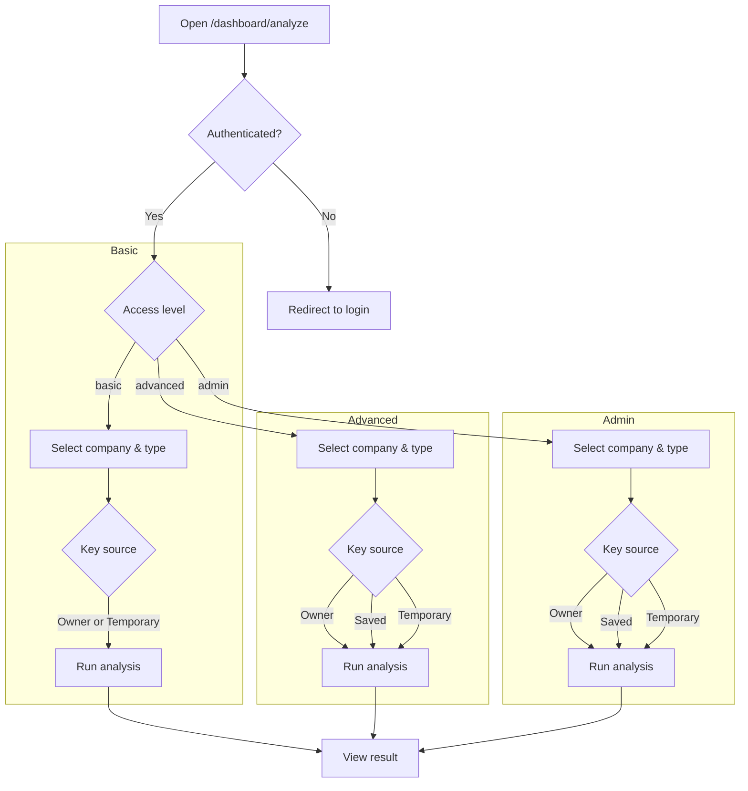

# Analyze Page Workflow

This document illustrates how different user types interact with the Analyze page. All users must sign in before accessing `/dashboard/analyze`.

**User Types**

- **Basic** – Uses admin-assigned keys or a temporary key. Cannot save personal keys.
- **Advanced** – May save personal API keys in addition to any assigned by an admin.
- **Admin** – Full privileges, including managing keys and system settings.
