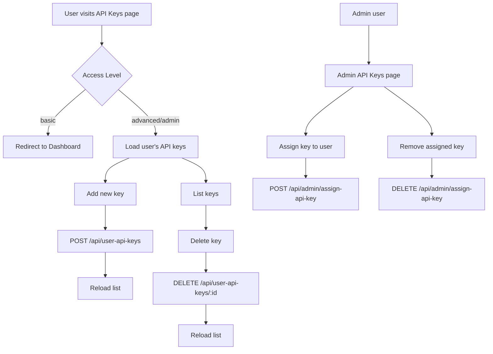

# API Key Page Workflow

This document explains how the **API Key** management pages behave for each user type.

- **Basic users**: Redirected away; cannot manage personal API keys.
- **Advanced users**: Can add and delete their own API keys.
- **Admin users**: Have advanced permissions plus a separate admin page to assign keys to other users.
