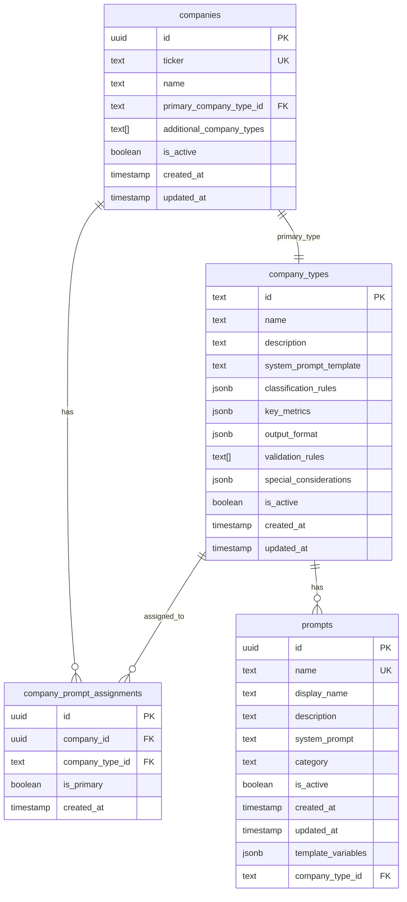
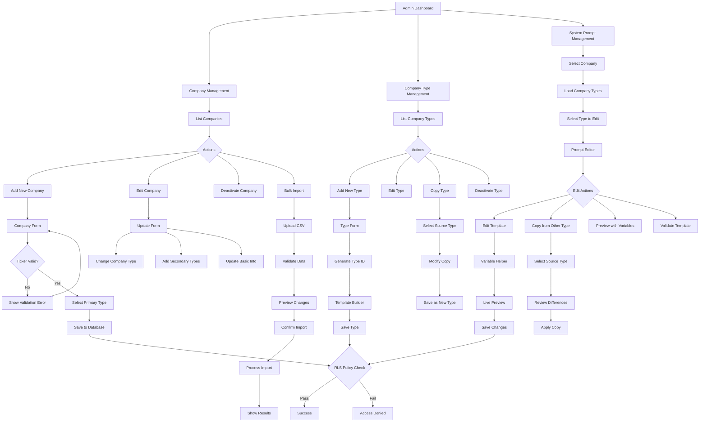

# Company Administration Workflow

This document outlines the comprehensive workflow for managing companies, company types, and system prompts in NextER.

## Overview

The company administration system allows admins to:
- Manage companies and their tickers
- Create and modify company types (industry templates)
- Manage system prompts for each company type
- Copy prompts between company types
- Assign company types to companies
- Bulk operations for efficiency

## Database Architecture

## Company Administration Workflow

## Feature Implementation Plan

### Phase 1: Core Company Management
1. **Company Management Page** (`/dashboard/admin/companies`)
   - List all companies with search/filter
   - Add new company with ticker validation
   - Edit company details
   - Assign primary and secondary company types
   - Bulk import via CSV

### Phase 2: Company Type Management
1. **Company Type Management Page** (`/dashboard/admin/company-types`)
   - List all company types
   - Add new company type with ID generation
   - Copy existing type as template
   - Edit type metadata and configuration
   - Preview type usage across companies

### Phase 3: Enhanced Prompt Management
1. **Enhanced System Prompts Page**
   - Current functionality plus:
   - Copy prompts between types
   - Bulk edit capabilities
   - Template variable management
   - Version history
   - Preview with real data

### Phase 4: Advanced Features
1. **Prompt Templates Library**
   - Pre-built industry templates
   - Community-shared templates
   - Template marketplace

2. **Analytics Dashboard**
   - Usage by company type
   - Performance metrics per type
   - Prompt effectiveness tracking

## API Endpoints Required

### Company Management
- `GET /api/admin/companies` - List all companies
- `POST /api/admin/companies` - Create new company
- `PUT /api/admin/companies/[id]` - Update company
- `DELETE /api/admin/companies/[id]` - Deactivate company
- `POST /api/admin/companies/bulk-import` - Bulk import

### Company Type Management
- `GET /api/admin/company-types` - List all types
- `POST /api/admin/company-types` - Create new type
- `PUT /api/admin/company-types/[id]` - Update type
- `DELETE /api/admin/company-types/[id]` - Deactivate type
- `POST /api/admin/company-types/copy` - Copy type

### Prompt Management
- `GET /api/admin/prompts/[type_id]` - Get prompts for type
- `PUT /api/admin/prompts/[type_id]` - Update prompt
- `POST /api/admin/prompts/copy` - Copy prompt between types
- `GET /api/admin/prompts/preview` - Preview with variables

## Security Considerations

1. **Row Level Security (RLS)**
   - Admin-only access for all management operations
   - Audit logging for all changes
   - Version control for prompts

2. **Validation**
   - Ticker uniqueness
   - Type ID format validation
   - Template variable validation
   - Circular reference prevention

3. **Performance**
   - Indexed searches on tickers
   - Cached company type lookups
   - Optimized bulk operations

## User Experience Guidelines

1. **Intuitive Navigation**
   - Clear breadcrumbs
   - Quick actions menu
   - Keyboard shortcuts

2. **Smart Defaults**
   - Auto-generate type IDs from names
   - Pre-fill common template variables
   - Suggest related types

3. **Error Prevention**
   - Real-time validation
   - Confirmation dialogs for destructive actions
   - Undo capabilities

4. **Efficiency Features**
   - Bulk operations
   - Quick copy actions
   - Template inheritance

## Implementation Priority

1. **High Priority**
   - Basic company CRUD operations
   - Company type assignment
   - Prompt copying functionality

2. **Medium Priority**
   - Bulk import/export
   - Template versioning
   - Advanced search/filter

3. **Low Priority**
   - Template marketplace
   - Analytics dashboard
   - AI-suggested improvements