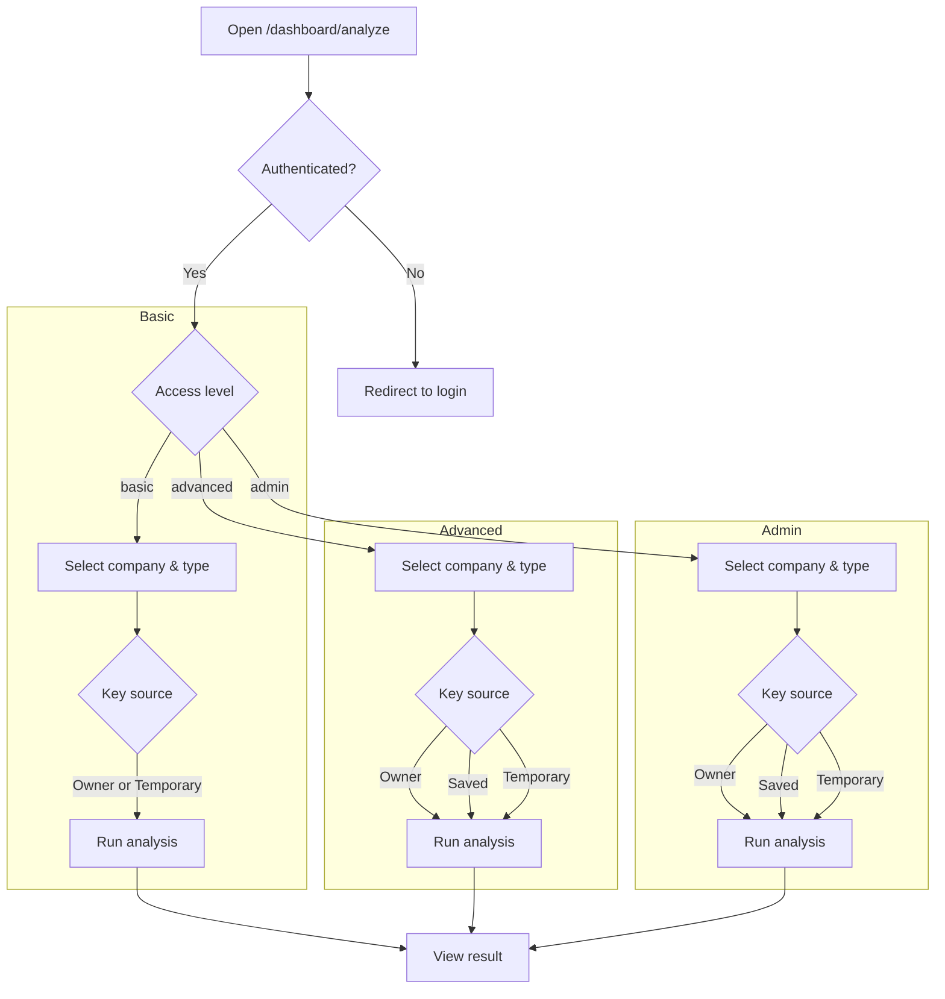
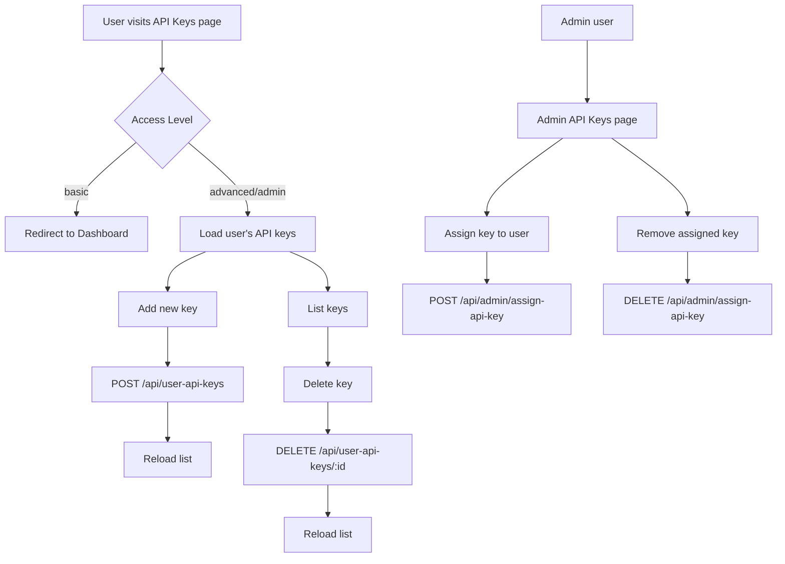

# Application Workflows

This document contains Mermaid diagrams illustrating various user and system workflows within the application.

## Admin Page Flow

This diagram shows how the admin dashboard behaves for each user type.

```mermaid
graph TD
    A[User visits /dashboard/admin] --> B{access_level == "admin"?}
    B -- No --> C[Redirect to /dashboard]
    B -- Yes --> D[Show Admin Dashboard]
    D --> E[View Stats Cards]
    D --> F[API Key Management]
    D --> G[User Management]
    D --> H[Usage Analytics]
```

## Analyze Page Flow

This diagram illustrates how different user types interact with the Analyze page.



## Analyze Page Step-by-Step Workflow

This diagram details the step-by-step workflow on the analyze page.

```mermaid
flowchart TD
  A[Transcript Textarea]
  B[Ticker Input]
  C[Search Button]
  B --> C
  C --> D{Filtered Companies}
  D -->|Select| E[Selected Company]
  E --> F[Fetch Company Types]
  F --> G[Analysis Type Dropdown]
  G --> H[Provider Selection]
  H --> I[Model Dropdown]
  H --> J[API Key Source]
  J --> K[Saved API Key Dropdown]
  J --> L[Temporary API Key]
  K --> M[Analyze Button]
  L --> M
  I --> M
  M --> N[/api/analyze POST]
  N --> O[Result Display]
  O --> P[Copy Button]
  O --> Q[Download Word]
  O --> R[View Toggle]
  O --> S[Error Messages]
```

## API Key Page Workflow

This diagram explains how the API Key management pages behave for each user type.



## Supabase Connection Workflow

This diagram maps how the application communicates with Supabase.

```mermaid
graph TD
  subgraph Client
    A[React pages & components]
    B[Supabase.js client]
  end
  subgraph API Routes
    C[/api/analyze]
    D[/api/companies]
    E[/api/user-api-keys]
    F[/api/user-api-keys/[id]]
    subgraph Admin
      G[/api/admin/users]
      H[/api/admin/assign-api-key]
      I[/api/admin/usage]
      J[/api/admin/stats]
    end
  end
  A -->|auth & queries| B
  B -->|anon key| K[(Supabase)]
  A -->|fetch| C
  A -->|fetch| D
  A -->|fetch| E
  A -->|fetch| F
  A -->|fetch| G
  A -->|fetch| H
  A -->|fetch| I
  A -->|fetch| J
  C -->|service role| K
  D -->|service role| K
  E -->|service role| K
  F -->|service role| K
  G -->|service role| K
  H -->|service role| K
  I -->|service role| K
  J -->|service role| K
```
