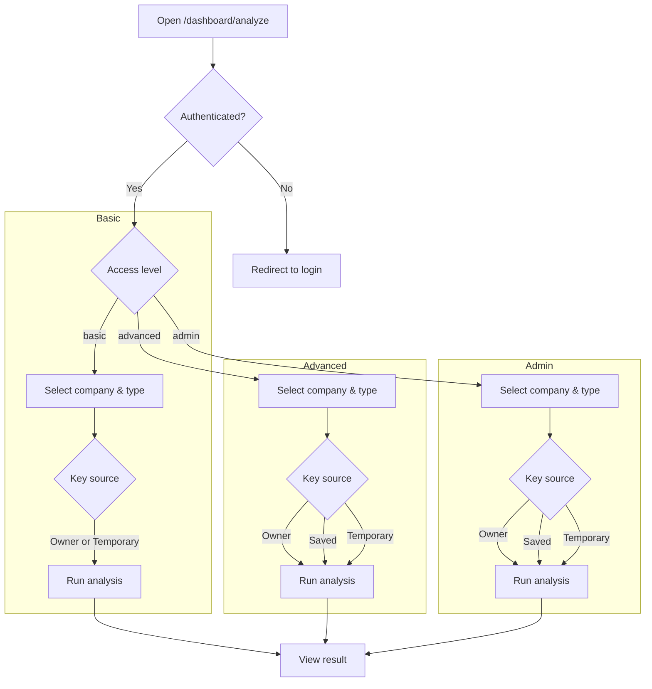
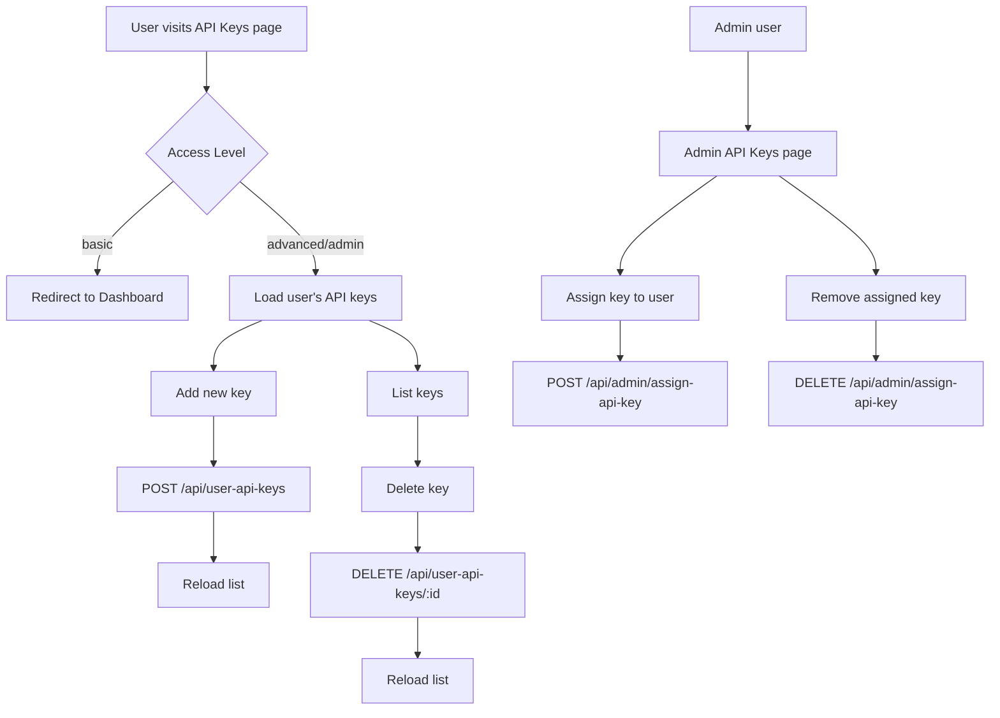

# Application Workflows

This document contains Mermaid diagrams illustrating various user and system workflows within the application.

## Admin Page Flow

This diagram shows how the admin dashboard behaves for each user type.

```mermaid
graph TD
    A[User visits /dashboard/admin] --> B{access_level == "admin"?}
    B -- No --> C[Redirect to /dashboard]
    B -- Yes --> D[Show Admin Dashboard]
    D --> E[View Stats Cards]
    D --> F[API Key Management]
    D --> G[User Management]
    D --> H[Usage Analytics]
```

## Analyze Page Flow

This diagram illustrates how different user types interact with the Analyze page.



## Analyze Page Step-by-Step Workflow

This diagram details the step-by-step workflow on the analyze page with the new company-types API endpoint.

```mermaid
flowchart TD
  A[Transcript Textarea]
  B[Ticker Input]
  C[Search Button]
  B --> C
  C --> D{Companies API Response}
  D -->|Select| E[Selected Company]
  E --> F[GET /api/company-types?companyId=X]
  F -->|Success| G[Analysis Type Dropdown Populated]
  F -->|Error| GF[Fallback to General Analysis]
  G --> H[Provider Selection]
  GF --> H
  H --> I[Model Dropdown Auto-Updated]
  H --> J[API Key Source Selection]
  J -->|user_saved| K[Saved API Key Dropdown]
  J -->|user_temporary| L[Temporary API Key Input]
  J -->|owner| M[Use System Keys]
  K --> N{API Key Available?}
  N -->|Yes| O[Analyze Button Enabled]
  N -->|No| P[Show "Add API Key" Link]
  L --> O
  M --> O
  I --> O
  O --> Q[POST /api/analyze]
  Q -->|Success| R[Result Display]
  Q -->|Error| S[Error Messages]
  R --> T[Copy Button]
  R --> U[Download Word]
  R --> V[View Toggle: Rendered/Markdown]
  
  subgraph Fallback["Error Handling"]
    GF
    P
    S
  end
  
  style F fill:#e1f5fe
  style Q fill:#e8f5e8
  style GF fill:#ffebee
  style P fill:#fff3e0
  style S fill:#ffebee
```

## API Key Page Workflow

This diagram explains how the API Key management pages behave for each user type.



## Supabase Connection Workflow

This diagram maps how the application communicates with Supabase, including the new company-types endpoint.

```mermaid
graph TD
  subgraph Client
    A[React pages & components]
    B[Supabase.js client]
  end
  subgraph API Routes
    C[/api/analyze]
    D[/api/companies]
    CT[/api/company-types]
    E[/api/user-api-keys]
    F[/api/user-api-keys/[id]]
    subgraph Admin
      G[/api/admin/users]
      H[/api/admin/assign-api-key]
      I[/api/admin/usage]
      J[/api/admin/stats]
    end
  end
  A -->|auth & session| B
  B -->|anon key + RLS| K[(Supabase)]
  A -->|fetch + JWT| C
  A -->|fetch + JWT| D
  A -->|fetch + JWT| CT
  A -->|fetch + JWT| E
  A -->|fetch + JWT| F
  A -->|fetch + JWT| G
  A -->|fetch + JWT| H
  A -->|fetch + JWT| I
  A -->|fetch + JWT| J
  C -->|service role| K
  D -->|service role| K
  CT -->|service role| K
  E -->|service role| K
  F -->|service role| K
  G -->|service role| K
  H -->|service role| K
  I -->|service role| K
  J -->|service role| K
  
  subgraph Tables
    K --> T1[companies]
    K --> T2[company_types]
    K --> T3[user_api_keys]
    K --> T4[user_profiles]
    K --> T5[usage_logs]
  end
  
  style CT fill:#e1f5fe
  style T2 fill:#e1f5fe
```
